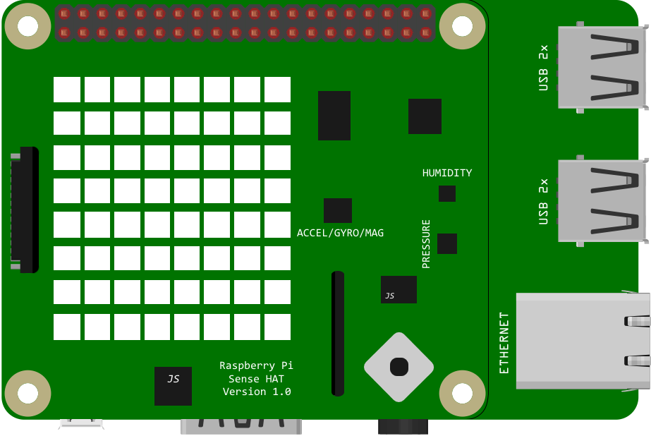

# Air Quality Sensor
This project monitors the air quality. The board uses a set of sensor which includes a barometer, a humidity sensor and a temperature sensor. The sensor captures the temperature, air pressure and humidity levels and send them to the phone. The phone displays the current levels in real-time, as well as a graph which shows historical data for the air temperature. Moreover, when the sensors detect that the air's quality reached some configured threshold values, it sends a notification to the phone.

## Schematics



## Pre-requisites
- [Raspberry Pi 4B board](https://www.raspberrypi.com/products/raspberry-pi-4-model-b/)
- [Sense HAT (sensors anssemble)](https://www.raspberrypi.com/products/sense-hat/)
- [Eclipse Moquitto MQTT Broker](https://mosquitto.org/download/)
- [Android Studio](https://developer.android.com/studio) (We are using Android Studio Artic Fox)
- An Android phone with a minimum API level of 27 (Android 8)

## Setup and Build

To setup, follow these steps below.

1. Install Mosquitto MQTT Server on the Raspberry Pi
    ```
    sudo apt install mosquitto mosquitto-clients
    ```
2. Configure Mosquitto username and password
  - create the password file, which will contain the username and encrypted password
    ```
    sudo mosquitto_passwd -c /etc/mosquitto/passwd.txt <user_name>
    ```
  - add the following entries in the mosquitto.conf file, inside /etc/mosquitto folder
    ```
    allow_anonymous false
    password_file /etc/mosquitto/passwd.txt
    ```
  - restart the mosquitto server to make sure the changes are saved
    ```
    sudo systemctl restart mosquitto
    ```
3. Copy the AirQualitySensorApp folder to Raspberry Pi
4. Modify the username and password in app.config file, inside the AirQualitySensorApp folder
   - the username and password must be on the same line, separated by a semicolon: ';'
5. If needed, modify the configured threshold values inside de main.py file from the AirQualitySensorApp folder
6. In the CompanionApp project, inside the build.gradle file from the app folder, modify the mosquitto username and password, and the Raspberry Pi server's IP address. The port must remain 1883

The `CompanionApp` project will run on the companion device e.g. Android phone.

## Running

To run the `CompanionApp` project on your Android phone:
1. Deploy and run the `CompanionApp` project
2. Verify that input is received from the broker and that it's displayed on the companion device's screen
3. Verify that the graph displays the historical data
4. Verify that a notification is received when the configured threshold values are hit

To run the `AirQualitySensorApp` module on a Raspberry Pi 4B board:

1. Run the following command from the terminal:
  ```
  python3 main.py
  ```
2. Verify that the sensor works and the program is printing the temperature, humidity, pressure and timestamp values
